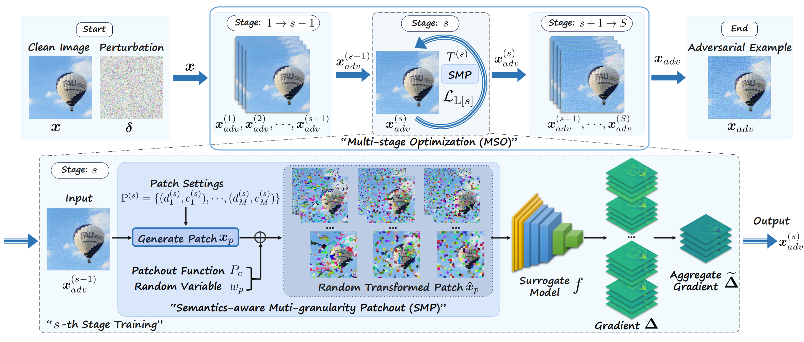

# SMP-Attack

[[Paper](https://openaccess.thecvf.com/content/ICCV2025/papers/Yang_SMP-Attack_Boosting_the_Transferability_of_Feature_Importance-based_Adversarial_Attack_with_ICCV_2025_paper.pdf)] [[Supp](https://openaccess.thecvf.com/content/ICCV2025/supplemental/Yang_SMP-Attack_Boosting_the_ICCV_2025_supplemental.pdf)] [[Poster](https://iccv.thecvf.com/virtual/2025/poster/635)] [[Video](https://youtu.be/5p4LxrBjxV0)]

The official implementation of [**\[ICCV 2025\] "SMP-Attack: Boosting the Transferability of Feature Importance-based Adversarial Attack with Semantics-aware Multi-granularity Patchout", Wen Yang, Guodong Liu, Di Ming✉.**](https://openaccess.thecvf.com/content/ICCV2025/html/Yang_SMP-Attack_Boosting_the_Transferability_of_Feature_Importance-based_Adversarial_Attack_with_ICCV_2025_paper.html)


## Introduction

Transfer-based attacks pose a significant security threat to deep neural networks (DNNs), due to their strong performance on unseen models in real-world black-box scenarios.Building on this, feature importance-based attacks further improve the transferability of adversarial examples by effectively suppressing model-specific feature patterns. However, existing methods primarily focus on single-granularity patch and single-stage training, leading to suboptimal solutions. To address these limitations, we propose a general multi-stage optimization framework based on Semantics-aware Multi-granularity Patchout, dubbed as SMP-Attack. Compared to the non-deformable/regular patch definition, we incorporate multi-granularity into the generation process of deformable/irregular patches, thereby enhancing the quality of the computed aggregate gradient. In contrast to conventional joint optimization of multi-layer losses, we introduce an effective multi-stage training strategy that systematically explores significant model-agnostic features from shallow to intermediate layers. Employing the ImageNet dataset, we conduct extensive experiments on undefended/defended CNNs and ViTs, which unequivocally demonstrate the superior performance of our proposed SMP-Attack over current state-of-the-art methods in black-box scenarios. Furthermore, we assess the compatibility of our multi-stage optimization, which supersedes single-stage training employed in existing feature-based methods, culminating in substantial performance improvement.

# 

# Getting Started

## Dependencies

- Python 3.6.0
- Keras 2.2.4
- Tensorflow (GPU) 1.15.1
- Numpy 1.19.5
- Pillow 8.3.2

## Usage Instructions

#### Models and Datasets

1. Download the pretrained checkpoints into `./models_tf` before running the code.

- [Normlly trained models]( https://github.com/tensorflow/models/tree/master/research/slim)
- [Adversarial trained models]( https://github.com/tensorflow/models/tree/archive/research/adv_imagenet_models)
- [Vision transformers models](https://github.com/rwightman/pytorch-image-models)

2. We conduct experiments on the ImageNet-compatible dataset, comprising 1000 images, used in the NIPS 2017 adversarial competition. The image path is `./dataset/images`.

#### Running attacks

- `./attack_SMP.py`: TensorFlow implementation of our SMP-Attack method (main entry script).

- `./cpp/SLICSP.cpp`: C++ core implementation of Semantics-aware Multi-granularity PatchOut, used to accelerate attack computations. Compile into a shared library (e.g., `SLICSP.so`) with the command `g++ SLICSP.cpp -fPIC -shared -o SLICSP.so` and call it from `attack_SMP.py`.

- `./runSMP.sh`: Execution script containing concrete parameter settings and execution modes (e.g., single-stage or multi-stage SMP-Attack). Edit this script to reproduce experiments or tune parameters.

#### Evaluate the success rate

- Normlly trained models and Adversarial trained models.

  `python verify_cnns.py`

- Vision transformers models.

  `python verify_vits.py`

## Acknowledgments

 Code refers to [FIA](https://github.com/hcguoO0/FIA), [RPA](https://github.com/alwaysfoggy/RPA).

 We thanks the authors for sharing sincerely.

## Citation

 If you find this work is useful in your research, please cite our paper:

```
@InProceedings{SMP_Attack,
    author    = {Yang, Wen and Liu, Guodong and Ming, Di},
    title     = {SMP-Attack: Boosting the Transferability of Feature Importance-based Adversarial Attack with Semantics-aware Multi-granularity Patchout},
    booktitle = {Proceedings of the IEEE/CVF International Conference on Computer Vision (ICCV)},
    month     = {October},
    year      = {2025},
    pages     = {4444-4454}
}

```

## Contact

[Wen Yang](https://github.com/Winwina8/Winwina8.github.io/): [winwina8@126.com](mailto:winwina8@126.com)

[Di Ming](https://midasdming.github.io/): [diming@cqut.edu.cn](mailto:diming@cqut.edu.cn)


